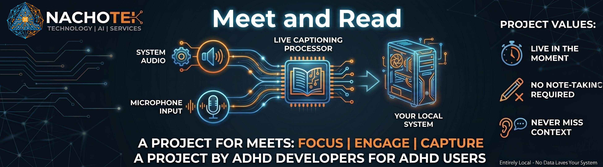
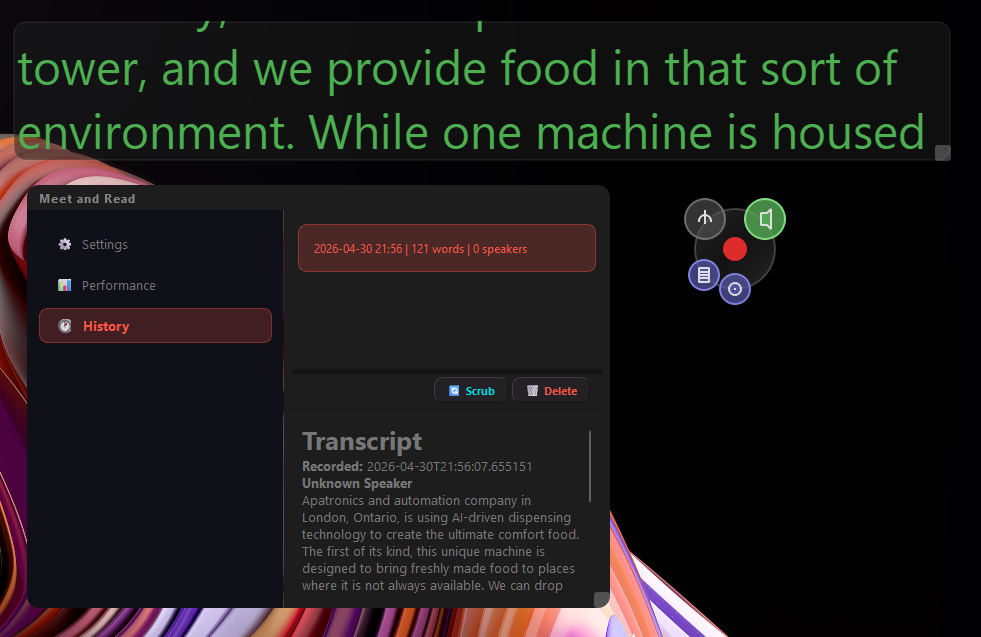

<p align="center">
  
</p>

<h3 align="center">Zero information loss during conversations</h3>

<p align="center">
  Windows desktop audio transcription widget — stay present, capture everything.<br>
  Built for meetings, calls, and conversations you don't want to forget.
</p>

<p align="center">
  
  
  
  
</p>

<p align="center">
  <a href="#features">Features</a> •
  <a href="#install">Install</a> •
  <a href="#quick-start">Quick Start</a> •
  <a href="#how-it-works">How It Works</a> •
  <a href="#configuration">Configuration</a> •
  <a href="#development">Development</a>
</p>

---

## What is MeetAndRead?

MeetAndRead is a compact, always-on-top desktop widget that records and transcribes audio in real time using [Whisper](https://github.com/ggerganov/whisper.cpp) (via `pywhispercpp`). It captures microphone input and Windows system audio (WASAPI loopback), transcribes speech live, and produces formatted Markdown transcripts with speaker identification.

The widget sits on your desktop like a record button — click to start, click to stop. A live closed-captioning overlay shows what's being said as it happens. When you stop recording, a stronger model runs post-processing for higher accuracy, and the final transcript is saved to disk.

<p align="center">
  
</p>

---

## Features

### 🎙️ Audio Capture
- **Microphone input** — capture your voice via any recording device
- **System audio** — WASAPI loopback captures what others are saying (Windows 11)
- **Dual-source** — record both simultaneously for complete coverage

### 📝 Real-Time Transcription
- **Live closed captions** — CC-style overlay shows speech as it happens
- **Whisper models** — choose tiny, base, or small for real-time; base through large for post-processing
- **Confidence coloring** — low-confidence words highlighted so you can spot gaps
- **Phrase detection** — 3-second silence detection for natural turn-taking

### 🔊 Speaker Identification
- **Voice signatures** — automatic speaker embedding and matching via sherpa-onnx
- **Speaker diarization** — identify who said what in multi-person conversations
- **Persistent signatures** — recognized speakers remembered across recordings

### 🎛️ Polished Desktop Widget
- **Aetheric Glass design** — translucent, always-on-top floating widget
- **Drag & dock** — move anywhere on screen, snaps to desktop edges
- **System tray** — minimize to tray, runs quietly in the background
- **Audio source lobes** — toggle mic and system audio with overlapping buttons

### ⚙️ Settings & Management
- **Model selection** — choose real-time and post-process models independently
- **Benchmark history** — see WER and speed for each model on your hardware
- **Recording management** — browse, review, and delete past recordings
- **Transcript scrub** — re-transcribe with a stronger model and compare results

### 🏗️ Production Ready
- **Portable build** — PyInstaller onedir, no Python needed to run
- **CI/CD** — automated testing and GitHub Releases on tag push
- **Resource monitoring** — live CPU/RAM tracking with threshold warnings

---

## Install

### Pre-built Release (Recommended)

Download the latest zip from [GitHub Releases](https://github.com/NachoTek/meetandread/releases):

1. Download `meetandread-v0.6.0.zip`
2. Extract anywhere
3. Run `meetandread.exe`

No Python installation required.

### From Source

```bash
# Clone the repo
git clone https://github.com/NachoTek/meetandread.git
cd meetandread

# Install with dev dependencies
pip install -e ".[dev]"

# Run
python -m meetandread.main
```

**Requirements:** Python 3.10+, Windows 11

---

## Quick Start

1. **Launch** MeetAndRead — the widget appears on your desktop
2. **Select audio sources** — click the mic and/or system audio lobes around the record button
3. **Click the record button** — recording starts, live transcription appears in the CC overlay
4. **Click again to stop** — post-processing runs with a stronger model
5. **Review** — open the Settings panel → History tab to browse transcripts

Your recordings and transcripts are saved in your Documents folder under `MeetAndRead/`.

---

## How It Works

MeetAndRead uses a **hybrid transcription** architecture:

```
┌─────────────┐     ┌──────────────────┐     ┌─────────────────┐
│ Audio Input  │────▶│ Real-Time Engine │────▶│ CC Overlay      │
│ (mic+system) │     │ (tiny/base Whisper)│    │ (live display)  │
└─────────────┘     └──────────────────┘     └─────────────────┘
                            │
                     audio saved to disk
                            │
                            ▼
                    ┌──────────────────┐     ┌─────────────────┐
                    │ Post-Processing  │────▶│ Markdown        │
                    │ (base/small/med) │     │ Transcript      │
                    └──────────────────┘     └─────────────────┘
                            │
                            ▼
                    ┌──────────────────┐
                    │ Speaker           │
                    │ Diarization       │
                    │ (sherpa-onnx)     │
                    └──────────────────┘
```

1. **Real-time** — A smaller Whisper model transcribes audio as it's captured, updating the CC overlay every ~2 seconds with accumulated context
2. **Post-processing** — When recording stops, a stronger model re-transcribes the full audio for higher accuracy
3. **Speaker diarization** — sherpa-onnx segments the audio by speaker and matches against stored voice signatures

---

## Configuration

Settings are managed through the Settings panel (click the gear lobe on the widget) and persisted in `AppData/meetandread/settings.json`.

| Setting | Default | Description |
|---------|---------|-------------|
| Real-time model | `tiny` | Whisper model for live transcription |
| Post-process model | `base` | Whisper model for final transcript |
| Enable post-processing | `true` | Run stronger model after recording |
| Speaker diarization | `true` | Identify speakers in recordings |
| Confidence threshold | `0.7` | Below this, words are highlighted |

---

## Project Structure

```
src/meetandread/
├── main.py                      # Application entry point
├── audio/
│   ├── capture/                 # Audio source backends (WASAPI, sounddevice)
│   ├── storage/                 # PCM buffering, WAV finalization
│   └── session.py               # Recording session coordinator
├── config/                      # Settings models and persistence
├── hardware/                    # Hardware detection and model recommendations
├── performance/                 # Resource monitoring, WER benchmarking
├── recording/                   # Recording controller (UI-facing API)
├── speaker/                     # Speaker diarization and voice signatures
├── transcription/               # Whisper engine, streaming pipeline, transcript store
└── widgets/                     # PyQt6 UI (widget, panels, theme, tray icon)
```

---

## Development

```bash
# Install dev dependencies
pip install -e ".[dev]"

# Run tests
python -m pytest

# Run tests (excluding slow benchmarks)
python -m pytest -m "not slow"

# Build portable executable
pip install pyinstaller
pyinstaller meetandread.spec --noconfirm
```

### Tech Stack

| Component | Technology |
|-----------|-----------|
| UI Framework | PyQt6 |
| Transcription | whisper.cpp (via pywhispercpp) |
| Speaker ID | sherpa-onnx |
| System Audio | WASAPI loopback (pyaudiowpatch) |
| Microphone | sounddevice |
| Audio Processing | numpy, soxr |
| Build | PyInstaller |
| CI/CD | GitHub Actions |

---

## License

This project is licensed under the GNU General Public License v3.0. See the [LICENSE](LICENSE) file for details.

---

<p align="center">
  
  <br>
  <sub>Built by <a href="https://github.com/NachoTek">NachoTek</a></sub>
</p>
